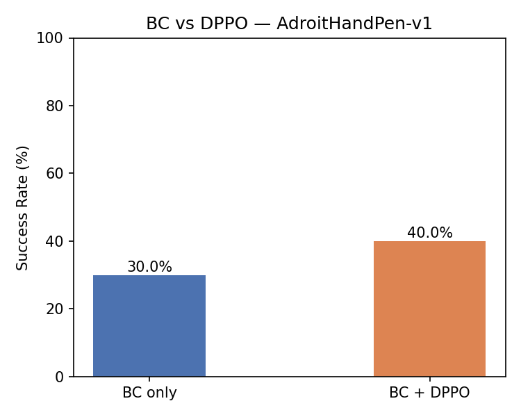
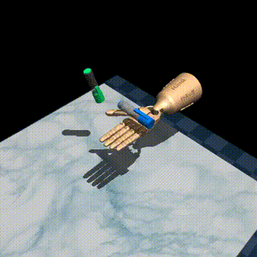

# DPPO for Dexterous Manipulation

## Overview
This repository contains a custom implementation of Diffusion Policy Policy Optimization (DPPO) tailored for high-dimensional, state-based dexterous manipulation tasks. The target environment is the `gymnasium-robotics` **Adroit Hand Pen task** (`AdroitHandPen-v1`), where a 24-DoF Shadow Hand must reorient a pen to match a randomized target orientation. Expert demonstrations are downloaded directly from the **Minari** offline RL dataset library (human demonstrations), bypassing the need to train an RL teacher. This implementation bridges generative diffusion models with reinforcement learning by fine-tuning a pre-trained diffusion policy to maximize task rewards using PPO.

## Results

<table>
  <tr>
    <td align="center"><b>BC vs DPPO Comparison</b><br></td>
    <td align="center"><b>Policy Rollout</b><br></td>
  </tr>
</table>

DPPO fine-tuning improves success rate over the BC baseline on `AdroitHandPen-v1`. Results evaluated over 20 episodes using fixed expert normalization stats.

## Architecture and Design
* Environment: `AdroitHandPen-v1` (Adroit Hand, gymnasium-robotics) — dense reward with +10.0 success bonus
* Expert Data: Human demonstrations downloaded from Minari (`D4RL/pen/expert-v2`) — 4,958 episodes, 499,206 steps, 83% success rate
* Observation Space: 1D flat state vector, 45 dims
* Action Space: Continuous, 24 Degrees of Freedom (absolute joint angles, scaled to [-1, 1])
* Policy Format: Action Chunking (predicts Tp=4 future steps, executes Ta=2 steps)
* Actor Network: MLP Backbone with Sinusoidal Positional Embeddings for the diffusion time-step (k)
* Critic Network: Standard MLP predicting bootstrapped state value V(s)
* Diffusion Strategy: DDPM sampling (stochastic), with RL fine-tuning applied exclusively to the last K'=3 steps of the denoising process

## Project Structure
The implementation is modularized into five primary components:

### 0. Expert Data (`download_expert_data.py`)
Downloads and converts human demonstration data from Minari into the format expected by BC pretraining. Run once before any training.
* **Download**: Fetches `D4RL/pen/expert-v2` via `minari.load_dataset()` — 4,130 successful episodes filtered from 4,958 total.
* **Conversion**: Extracts `(observation, action)` pairs from successful episodes, creates sliding-window action chunks of size `Tp=4`, and batch-normalizes states (mean/std + tanh) to put them in `[-1, 1]`.
* **Output**: Saves `expert_data.pt` with keys `{"states": [N, 45], "action_chunks": [N, 4, 24], "obs_mean": [45], "obs_std": [45]}`.

### 1. Environment Wrappers (`wrappers.py`)
* **Chunking Wrapper**: Accepts an action chunk of shape `[Ta, action_dim]`, executes actions sequentially, aggregates rewards, and returns the final observation.
* **Normalization Wrapper**: Fixed mean/std normalization from expert data followed by tanh squashing. Uses the same statistics as BC pretraining to eliminate distribution shift between training phases.
* **Reward Scaler**: Scales rewards by 0.1 to stabilize PPO advantage calculations.

### 2. Neural Network Backbones (`network.py`)
* **Actor (Diffusion MLP)**: Processes `[state, noisy_action_chunk, k_step]`. Sinusoidal positional embeddings encode the diffusion timestep `k`, which is concatenated with the flattened state and noisy action before passing through a 4-layer Mish MLP. Outputs predicted noise of shape `[chunk_size, act_dim]`.
* **Critic**: Standard MLP mapping state → scalar value `V(s)`. No k-step conditioning.

### 3. DPPO Math & Buffer (`dppo_math.py`)
* **Dashcam Buffer**: Preallocated buffer storing `T×K'` micro-step transitions. Stores `x_k` (noisy actions), `committed_noises` (sampled ε), k-steps, log-probs, advantages, and returns.
* **Advantage Estimation**: Bootstrapped `A_t = r_t + γ·V(s_{t+1}) − V(s_t)` broadcast to all K' denoising steps of the same environment step.
* **PPO Objective**: Clipped surrogate loss (ε=0.2) with Gaussian log-likelihoods computed in noise-prediction space using mean reduction over action dimensions.
* **Log Variance Helper**: Extracts `log(β_k)` from the DDPM scheduler's noise schedule for policy variance.

### 4. Training Loops (`train.py`)
* **Behavior Cloning**: Supervised pretraining on `expert_data.pt`. Corrupts expert actions at random diffusion steps via `scheduler.add_noise()` and trains the actor to predict the added noise via MSE.
* **Evaluation**: Deterministic rollout every 20 iterations over 20 episodes. Saves `actor_best.pt` when success rate improves.
* **DPPO Fine-Tuning**: K→0 denoising rollout with stochastic committed-noise sampling, PPO update over 2 epochs with gradient clipping (0.5), periodic checkpointing every 50 iterations to Google Drive.

### 5. Entry Points
* **`main.ipynb`**: Colab notebook. Mounts Google Drive, copies project files, installs dependencies. Skips BC if `actor_bc.pt` already exists, resumes DPPO from latest checkpoint if available. All checkpoints saved to `MyDrive/dppo/checkpoints/`.
* **`visualize.py`**: Loads checkpoints, runs deterministic evaluation, saves `eval_result.mp4`. Generates the **BC vs DPPO comparison plot** showing success rate improvement from RL fine-tuning.

## Demonstrating DPPO Effectiveness
The standard comparison used in the DPPO paper is:

| Policy | Description |
|---|---|
| **BC only** | `actor_bc.pt` — pure imitation, no RL |
| **BC + DPPO** | `actor_best.pt` — BC init fine-tuned with PPO |

`visualize.py` evaluates both checkpoints over 20 episodes each and plots success rate side-by-side. DPPO fine-tuning on the last K'=3 denoising steps extracts additional task performance beyond what imitation alone achieves.

## Training Order
```
1. python download_expert_data.py   # fetch Minari data, convert to expert_data.pt
2. main.ipynb                        # BC pretraining → DPPO fine-tuning
3. python visualize.py               # render video + BC vs DPPO comparison plot
```

## Output Files
| File | When saved | Contents |
|---|---|---|
| `expert_data.pt` | After download script | `{states:[N,45], action_chunks:[N,4,24], obs_mean:[45], obs_std:[45]}` |
| `actor_bc.pt` | After BC pretraining | Actor weights before RL (BC baseline) |
| `actor_iter50.pt` ... | Every 50 DPPO iterations | Periodic safety checkpoints |
| `actor_best.pt` | When eval success rate improves | Best policy by success rate |
| `actor_final.pt` | End of 500 iterations | Final policy weights |

## Interactive Codebase Graph

An interactive knowledge graph of this codebase is included at `.understand-anything/knowledge-graph.json`. To explore it locally:

```bash
cd ~/.claude/plugins/cache/understand-anything/understand-anything/2.7.6/packages/dashboard
GRAPH_DIR=/path/to/this/repo npx vite
```

Then open the token URL printed in the terminal.

> Requires [Claude Code](https://claude.ai/code) with the `understand-anything` plugin installed: `/plugin install understand-anything`

## References
* Original DPPO implementation and mathematical framework: https://github.com/irom-princeton/dppo
* Adroit Hand demonstrations: Rajeswaran et al., "Learning Complex Dexterous Manipulation with Deep Reinforcement Learning and Demonstrations" (2018)
